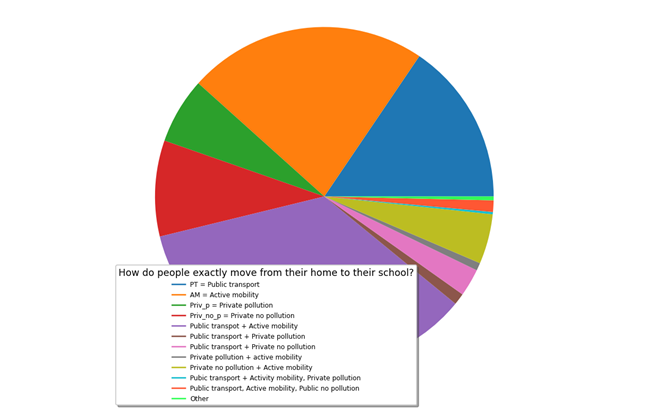
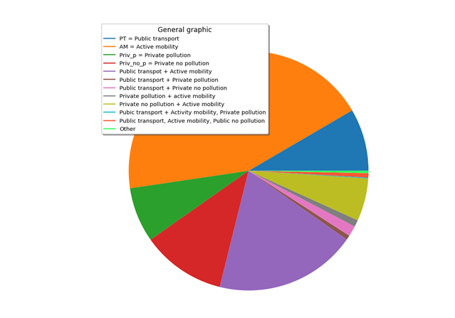
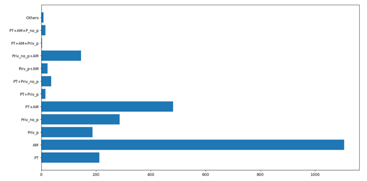
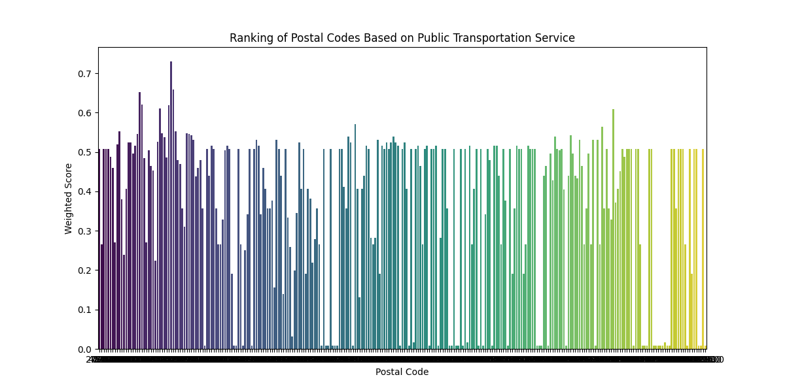

# Urban Mobility challenge
First of all we made a dataframe with everything we needed from the data we were provided
## 1. Which factors determine whether students use public or private transportation systems to go to the university?
For solve this problem we can consider that a good way to determine which factors determine whether students use public or private transportation systems to go to the university it will be to make a prediction model for the different factors of the student (the different questions of the survey) and look the explicative variables that have low p-value (this explains how important is this variable for the explain of our response variable).

[Explanation with R](which-factors-determine-whether-students-use-public-or-private-transportation.pdf)

##  2. Create a data visualization solution that summarizes the people flow generated daily by UPC students, by transportation category. A user of your solution should be able to answer some of the following questions:

# How do people exactly move from their home to their school?
The following pie chart resume which transport use studients to go to the University. 

And the following pie chart resume which transport use studients to go and return to the university. Also we attached a bar plot to vizualize the number of people in each group. This was done is grafic_barres_queso.py

# Which zones are better served in terms of public transportation?

We aimed to analyze the effectiveness of public transportation coverage across different
zones. To achieve this, we developed a code to calculate the proportion of individuals
using public transportation to reach a UPC campus within each postal code, considering
the total population of that postal code. Acknowledging the potential bias in favor of
smaller populations, we designed an additional code to determine the actual count of
individuals utilizing public transportation from each postal code. By combining these
insights, we generated a comprehensive prediction pinpointing zones that benefit from
robust public transportation services.
To do so we selected every student from the dataframe that had as its transportation method one of
the following: ‘Bus’, ‘FGC’, ‘Renfe’, ‘Tram’, ‘Underground’. Then we group these students by postal
code and count the ones in each group and we calculate the percentatge that represent from the total.
Then we have to set a weight to the number of people so that we can get a weighted score to each
one of the postal codes. Finally we make a ranking to see the ones with the highest weighted score:

