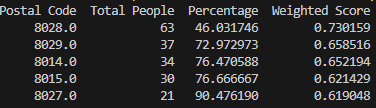

# Urban Mobility challenge
Project made by: Adrià Capdevila Zurita, Andreu Fernandez Cubí, Aleix Albaiges Torres i Aniol Garriga Torra.

First of all we made a [dataframe](dataframe.py) to collect all data we were provided. The module [dataframe](dataframe.py) is used to read the data come from the [excel file](Datathon_Results_MOBILITY_2022_original_Students.xlsx). We create a class in order to classify and save all the data.
## 1. Which factors determine whether students use public or private transportation systems to go to the university?
For solve this problem we can consider that a good way to determine which factors determine whether students use public or private transportation systems to go to the university it will be to make a prediction model for the different factors of the student (the different questions of the survey) and look the explicative variables that have low p-value (this explains how important is this variable for the explain of our response variable).
To do this we created a [dataset code](new_dataset.py) that extracts data of de dataframe and creates a [dataset file](dataset.csv) that we implemented later with R to create the linear model

[Explanation with R](which-factors-determine-whether-students-use-public-or-private-transportation.pdf)

##  2. Create a data visualization solution that summarizes the people flow generated daily by UPC students, by transportation category. A user of your solution should be able to answer some of the following questions:

### How do people exactly move from their home to their school?
The following pie chart resume which transport use studients to go to the University. We can see that the most used transport to go to the University is the combination of públic transport and active mobility (on foot or bike). Also we can see that many people do the whole trip using only public transport or active mobility.  

And the following pie chart resume which transport use studients to go and return to the university. Also we attached a bar plot to vizualize the number of people in each group. This was done in [global pie chartbarplot](grafic_barres_queso.py) The majority go and return to the University only using active mobility which inclue go on foot or by bike. The combination of públic transport, activity mobility and private vehicle that pollute is the less used by studients.  

### Which zones are better served in terms of public transportation?

We aimed to analyze the effectiveness of public transportation coverage across different
zones. To achieve this, we developed a code to calculate the proportion of individuals
using public transportation to reach a UPC campus within each postal code, considering
the total population of that postal code. Acknowledging the potential bias in favor of
smaller populations, we designed an additional code to determine the actual count of
individuals utilizing public transportation from each postal code. By combining these
insights, we generated a comprehensive prediction pinpointing zones that benefit from
robust public transportation services.
To do so we selected every student from the dataframe that had as its transportation method one of
the following: ‘Bus’, ‘FGC’, ‘Renfe’, ‘Tram’, ‘Underground’. Then we group these students by postal
code and count the ones in each group and we calculate the percentatge that represent from the total.
Then we have to set a weight to the number of people so that we can get a weighted score to each
one of the postal codes. Finally we make a ranking to see the ones with the highest weighted score, everything was done with the [weighted_score.py](weighted_score.py) program that uses the [importdata.py](importdata.py) program that it is a simplified version of the [dataframe.py](dataframe.py) program. This graph represents the weight score of each postal code, as there are many postal codes and it may be difficult to see, we can get a list with a ranking of the postal codes based on the score

### How long does it take them?

Measuring aproximately the time it takes UPC students to get to their faculty can be very tedious and can be done in different ways, but we will approach it as follows. We will take data from the “enquesta de mobilitat en dia feiner 2022 fet per ATM, Idescat i Institut Metròpoli, 2022”; where there is, among many others, data of the duration of the journey of students going from their home to the center where they study. The problem is that the data of origin and destination are only in county format, which means that we cannot have very good approximations. This is why we will assume that the students who go to a region to study (in the case of the Barcelonès, for example, there would be many different faculties, from the UPC and faculties from other universities) all take approximately the same time from their origin. 

Therefore, we will take the counties of the nine faculties of the UPC as the destination county, and we will calculate the estimated time for students who live in the different counties of the province of Barcelona and who go to one of these counties of the faculties. Also, the data AMB give us contains the principal transport way the student uses, so we can determine the average time of each student who goes from a region of the province of Barcelona to the region of the faculty in which he studies with the different methods of transport (we consider only three, public transport, private transport and active mobility).

The next python code show how we extract de data:

[Python code](Travel_time.py)

And these are the results:

[Results Travel time](travel_times.txt)

### Which zones are better served in terms of public transportation?
We have used public data about the stations of the different catalan public transports: FGC, Rodalies Renfe and bus and Barcelona underground (TMB). With this, we have obtained the number of pulbic transport stations in each municipality, referenced and mapped in a dictonary by their zip codes.

The next python code show how we extract de data:

[Python code](estacions.py)

And these are the results:

[Results Travel time](postcode_stops.txt)

